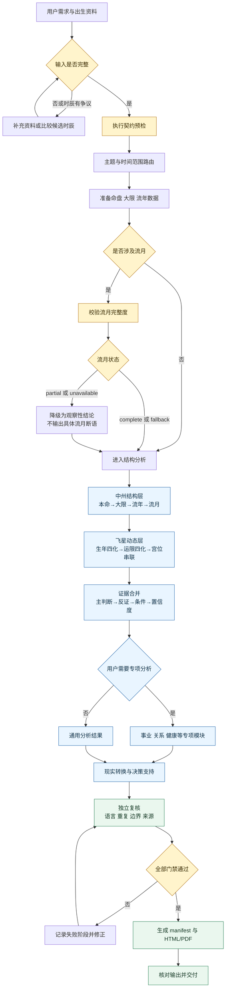

# doushu-v2

一个面向紫微斗数分析的模块化 Codex Skill。

## 工作流

这套流程的核心是：先核验资料和数据，再做结构层与动态层的双主轴推演，最后把结论转换成现实可验证的判断。任何一个前置门禁未通过，都不能直接进入最终交付。

## 功能

- 出生资料核验与时辰边界处理
- 本命、大限、流年、流月的数据分层
- 事业、关系、健康等专项分析路由
- 证据链、反证、现实验证和决策支持
- 流月数据完整度检查与本地排盘兜底
- 报告质量、重复、来源和执行门禁校验

## 目录

- `SKILL.md`：技能入口与工作流
- `modules/`：输入、数据、分析和交付模块
- `references/`：分析规则、证据规范和输出规范
- `scripts/`：校验、路由、报告和兜底工具
- `agents/openai.yaml`：Codex agent 配置

## 使用边界

本 Skill 输出的是传统命理框架下的条件化分析，不保证职业、财务、关系或健康结果；健康、法律和财务问题不能以命盘替代专业意见。

本公开仓库不包含个人案例、出生资料和研究资料原件。研究归档和本地案例应在私有环境中使用。

## 许可

除 `references/` 中另有来源或许可证说明的内容外，本仓库代码和原创文档采用 MIT License，见 `LICENSE`。
